# [📈 Live Status](https://demo.upptime.js.org): <!--live status--> **🟧 Partial outage**

This repository contains the open-source uptime monitor and status page for [ccris02](https://polkaDIR.com), powered by [Upptime](https://github.com/upptime/upptime).

With [Upptime](https://upptime.js.org), you can get your own unlimited and free uptime monitor and status page, powered entirely by a GitHub repository. We use [Issues](https://github.com/ccris02/Polkadot-upptime/issues) as incident reports, [Actions](https://github.com/ccris02/Polkadot-upptime/actions) as uptime monitors, and [Pages](https://demo.upptime.js.org) for the status page.

<!--start: status pages-->
<!-- This summary is generated by Upptime (https://github.com/upptime/upptime) -->
<!-- Do not edit this manually, your changes will be overwritten -->
<!-- prettier-ignore -->
| URL | Status | History | Response Time | Uptime |
| --- | ------ | ------- | ------------- | ------ |
|  [Kusama.network](https://kusama.network/) | 🟩 Up | [kusama-network.yml](https://github.com/ccris02/PolkaStats/commits/HEAD/history/kusama-network.yml) | 

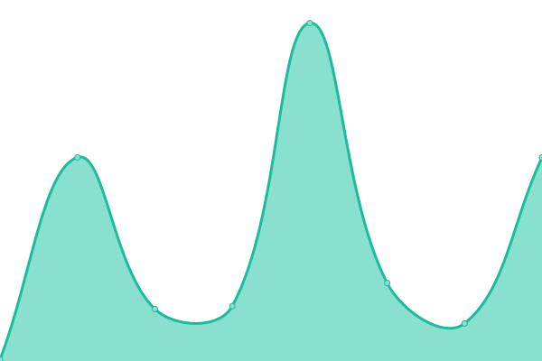 192ms
     
 | 

<a href="https://ccris02.github.io/PolkaStats/history/kusama-network">100.00%</a>
    

|  [Polkadot.network](https://polkadot.network/) | 🟩 Up | [polkadot-network.yml](https://github.com/ccris02/PolkaStats/commits/HEAD/history/polkadot-network.yml) | 

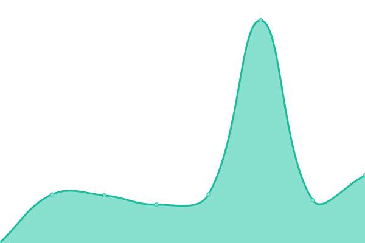 226ms
     
 | 

<a href="https://ccris02.github.io/PolkaStats/history/polkadot-network">100.00%</a>
    

|  [Vegas1KV.com](https://vegas1kv.com) | 🟩 Up | [vegas1-kv-com.yml](https://github.com/ccris02/PolkaStats/commits/HEAD/history/vegas1-kv-com.yml) | 

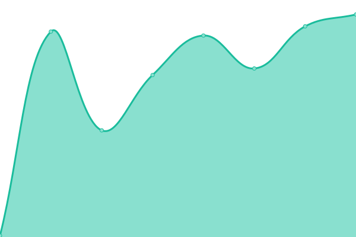 172ms
     
 | 

<a href="https://ccris02.github.io/PolkaStats/history/vegas1-kv-com">100.00%</a>
    

|  [PolkaDIR.com](https://polkadir.com) | 🟩 Up | [polka-dir-com.yml](https://github.com/ccris02/PolkaStats/commits/HEAD/history/polka-dir-com.yml) | 

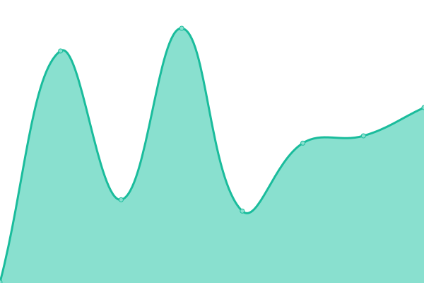 169ms
     
 | 

<a href="https://ccris02.github.io/PolkaStats/history/polka-dir-com">100.00%</a>
    

|  [Polkadot.js.org](https://polkadot.js.org) | 🟩 Up | [polkadot-js-org.yml](https://github.com/ccris02/PolkaStats/commits/HEAD/history/polkadot-js-org.yml) | 

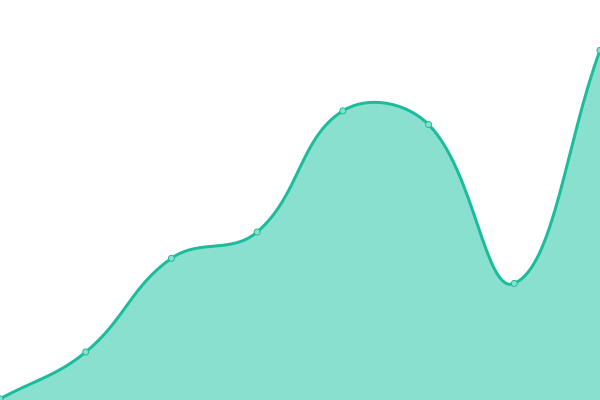 142ms
     
 | 

<a href="https://ccris02.github.io/PolkaStats/history/polkadot-js-org">100.00%</a>
    

|  [Polkadot Telemetry](https://telemetry.polkadot.io) | 🟩 Up | [polkadot-telemetry.yml](https://github.com/ccris02/PolkaStats/commits/HEAD/history/polkadot-telemetry.yml) | 

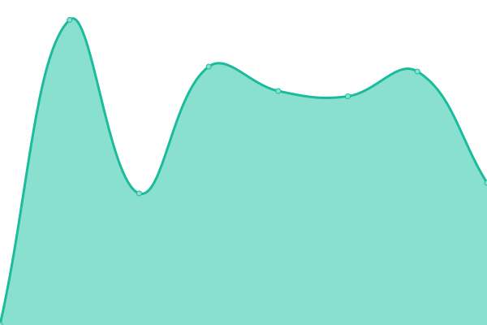 478ms
     
 | 

<a href="https://ccris02.github.io/PolkaStats/history/polkadot-telemetry">100.00%</a>
    

|  [W3F Telemetry](https://telemetry.w3f.community) | 🟩 Up | [w3-f-telemetry.yml](https://github.com/ccris02/PolkaStats/commits/HEAD/history/w3-f-telemetry.yml) | 

 524ms
     
 | 

<a href="https://ccris02.github.io/PolkaStats/history/w3-f-telemetry">100.00%</a>
    

|  [doTreasury.com](https://www.dotreasury.com) | 🟩 Up | [do-treasury-com.yml](https://github.com/ccris02/PolkaStats/commits/HEAD/history/do-treasury-com.yml) | 

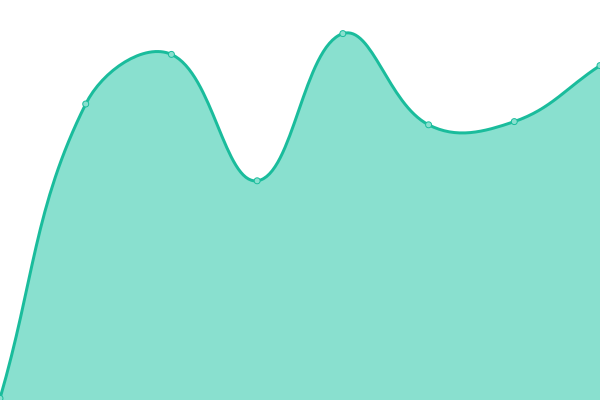 143ms
     
 | 

<a href="https://ccris02.github.io/PolkaStats/history/do-treasury-com">100.00%</a>
    

|  [Polkassembly.io](https://polkadot.polkassembly.io) | 🟩 Up | [polkassembly-io.yml](https://github.com/ccris02/PolkaStats/commits/HEAD/history/polkassembly-io.yml) | 

 1465ms
     
 | 

<a href="https://ccris02.github.io/PolkaStats/history/polkassembly-io">100.00%</a>
    

|  [PolkaProject.com](https://polkaproject.com) | 🟩 Up | [polka-project-com.yml](https://github.com/ccris02/PolkaStats/commits/HEAD/history/polka-project-com.yml) | 

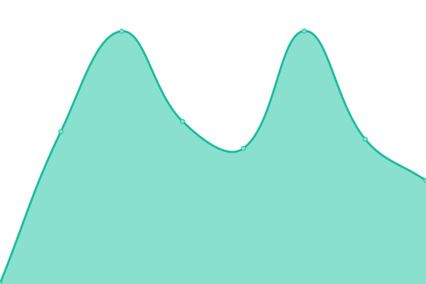 835ms
     
 | 

<a href="https://ccris02.github.io/PolkaStats/history/polka-project-com">100.00%</a>
    

|  [DOTspot.io](https://www.dotspot.io/projects) | 🟩 Up | [do-tspot-io.yml](https://github.com/ccris02/PolkaStats/commits/HEAD/history/do-tspot-io.yml) | 

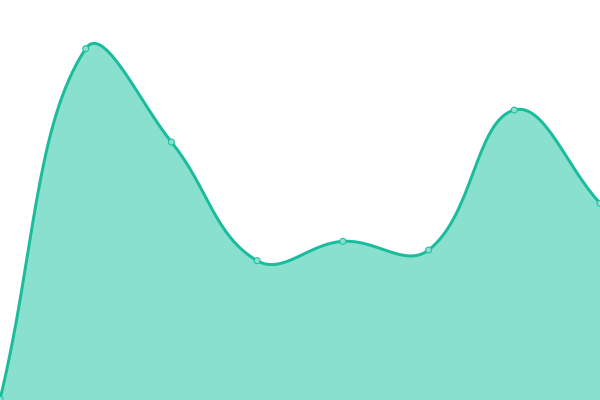 286ms
     
 | 

<a href="https://ccris02.github.io/PolkaStats/history/do-tspot-io">100.00%</a>
    

|  [DOTMarketCap.com](https://dotmarketcap.com) | 🟩 Up | [dot-market-cap-com.yml](https://github.com/ccris02/PolkaStats/commits/HEAD/history/dot-market-cap-com.yml) | 

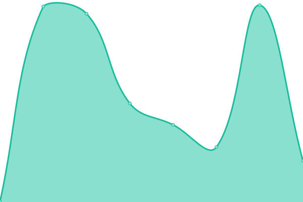 365ms
     
 | 

<a href="https://ccris02.github.io/PolkaStats/history/dot-market-cap-com">100.00%</a>
    

|  [Subscan.io](https://kusama.subscan.io) | 🟩 Up | [subscan-io.yml](https://github.com/ccris02/PolkaStats/commits/HEAD/history/subscan-io.yml) | 

 251ms
     
 | 

<a href="https://ccris02.github.io/PolkaStats/history/subscan-io">100.00%</a>
    

|  [sub.id](https://sub.id) | 🟩 Up | [sub-id.yml](https://github.com/ccris02/PolkaStats/commits/HEAD/history/sub-id.yml) | 

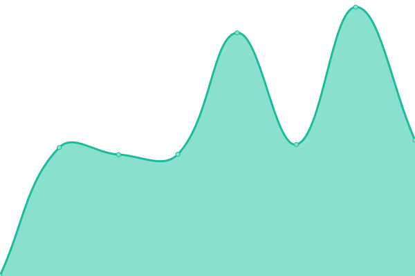 636ms
     
 | 

<a href="https://ccris02.github.io/PolkaStats/history/sub-id">100.00%</a>
    

|  [DOTscanner.com](https://dotscanner.com) | 🟥 Down | [do-tscanner-com.yml](https://github.com/ccris02/PolkaStats/commits/HEAD/history/do-tscanner-com.yml) | 

 97ms
     
 | 

<a href="https://ccris02.github.io/PolkaStats/history/do-tscanner-com">0.00%</a>
    

|  [Polkascan.io](https://polkascan.io/polkadot) | 🟩 Up | [polkascan-io.yml](https://github.com/ccris02/PolkaStats/commits/HEAD/history/polkascan-io.yml) | 

 1156ms
     
 | 

<a href="https://ccris02.github.io/PolkaStats/history/polkascan-io">100.00%</a>
    

|  [Polkastats.io](https://polkastats.io/) | 🟩 Up | [polkastats-io.yml](https://github.com/ccris02/PolkaStats/commits/HEAD/history/polkastats-io.yml) | 

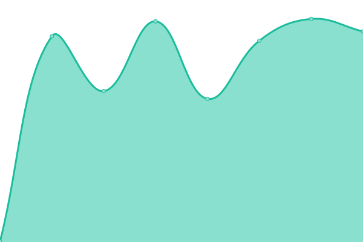 616ms
     
 | 

<a href="https://ccris02.github.io/PolkaStats/history/polkastats-io">100.00%</a>
    

|  [Subsocial.network](https://subsocial.network/) | 🟩 Up | [subsocial-network.yml](https://github.com/ccris02/PolkaStats/commits/HEAD/history/subsocial-network.yml) | 

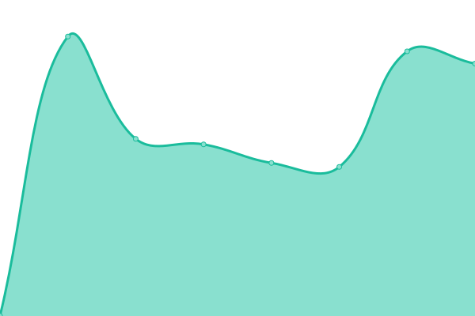 229ms
     
 | 

<a href="https://ccris02.github.io/PolkaStats/history/subsocial-network">100.00%</a>
    

<!--end: status pages-->

[**Visit our status website →**](https://demo.upptime.js.org)

## 📄 License

- Powered by: [Upptime](https://github.com/upptime/upptime)
- Code: [MIT](./LICENSE) © [ccris02](https://polkaDIR.com)
- Data in the `./history` directory: [Open Database License](https://opendatacommons.org/licenses/odbl/1-0/)
